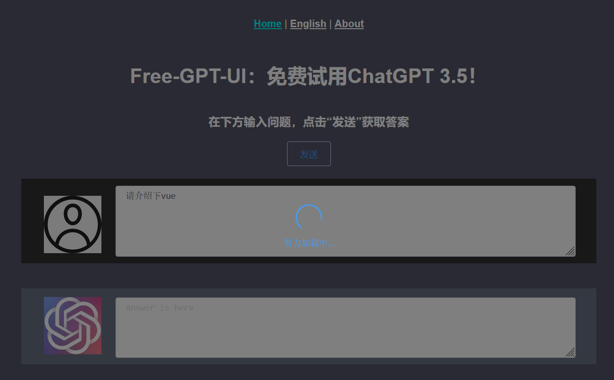
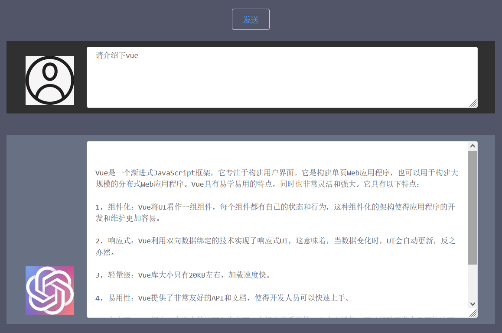

# 关于本项目

作者在逛GitHub的时候看到了[ayaka14732](https://github.com/ayaka14732)大神的<a href="https://github.com/ayaka14732/ChatGPTAPIFree">ChatGPTAPIFree</a> 项目，本着互联网的开源精神，使用该项目提供的接口制作了这个前端网站。

你可以在这里试用ChatGPT，和它对话，帮助你的学习生活，体验强人工智能的魅力！

本项目使用流行的前端框架 <a href="https://cli.vuejs.org/zh/guide/">Vue CLI 3.0</a> 搭建，node.js版本为v16.14.2。使用了axios库进行请求收发，UI样式采用了 <a href="https://element.eleme.cn">Element UI</a> 。





# 本地使用

> 请保证电脑已安装node.js

```
npm install
```

### 本地测试
```
npm run serve
```

### 编译发布
```
npm run build
```

# 关于作者

系统工程专业在读硕士研究生，喜欢跑步、骑行、游泳和做一些有趣的小玩意。

欢迎关注我的B站账号： <a href="https://space.bilibili.com/26575098" target="_blank" rel="noopener">Renz_华</a>

我的个人博客：<a href="https://renzehua1998.github.io/" target="_blank" rel="noopener">Blog</a>

国内访问可能受限，镜像站：<a href="https://renzehua.gitee.io/" target="_blank" rel="noopener">Blog</a>

